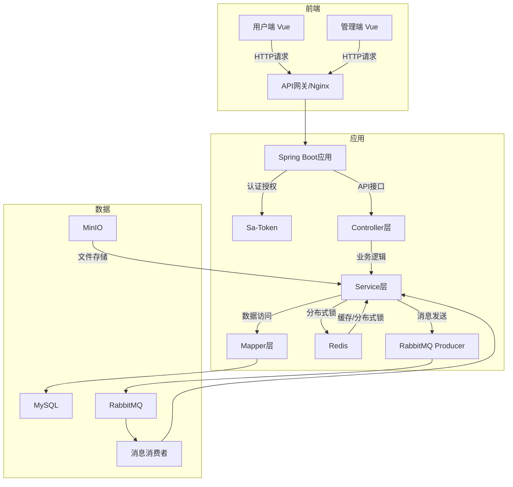
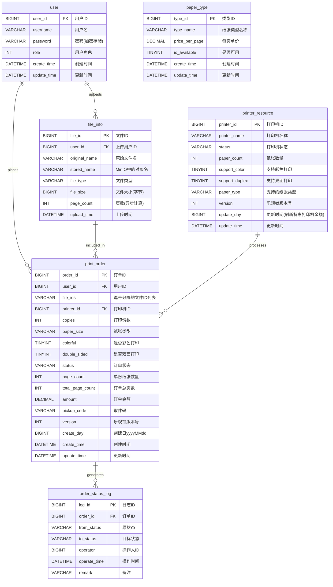

# 在线打印服务系统 (SuperPrinter)

## 1. 项目概述

本项目是一个基于 Spring Boot 和 Vue 构建的在线打印服务平台，旨在提供用户线上提交打印任务、线下扫码取件的便捷服务。系统采用前后端分离架构，后端为单体应用，注重分布式环境下的并发控制、数据一致性和系统可靠性。

仅做演示需求，模拟打印店的核心业务流程，重点在于后端架构设计和关键技术点的实现。

## 2. 主要功能

*   **用户端 (Vue)**:
    *   用户注册与登录
    *   文件上传
    *   打印参数配置 (纸张、颜色、份数等)
    *   订单状态查看
    *   获取取件二维码
*   **管理端 (Vue)**:
    *   订单列表查看与管理 (手动更新状态)
    *   打印机状态模拟管理 (在线/离线/缺纸等)
    *   取件码扫描核销接口调用 (模拟扫码枪或App)

## 3. 技术栈

*   **后端**:
    *   **核心框架**: Spring Boot
    *   **持久层**: MyBatis-Plus + MySQL
    *   **认证授权**: Sa-Token
    *   **分布式锁/缓存**: Redis (主要用于分布式锁和幂等控制)
    *   **对象存储**: MinIO
    *   **消息队列**: RabbitMQ (用于异步任务处理)
*   **前端**:
    *   **框架**: Vue
    *   **HTTP客户端**: Axios
*   **构建与部署**:
    *   **构建工具**: Maven
    *   **容器化**: Docker, Docker Compose

## 4. 系统架构与代码组织

### 4.1 架构图 (简化)



### 4.2 代码组织结构 (后端)

遵循标准的 MVC 分层结构，采用"朴素"的包组织方式：

```txt
com.coooolfan.printsystem
├── config          # 配置类 (MyBatisPlus, Redis, RabbitMQ, Sa-Token, Swagger等)
├── constant        # 常量定义
├── controller      # API接口层 (面向前后端)
├── entity          # 数据库实体类 (POJO)
├── enums           # 枚举类 (订单状态, 纸张类型等)
├── exception       # 自定义异常类及全局异常处理器
├── listener        # RabbitMQ 消费者/监听器
├── mapper          # 数据访问层接口 (MyBatis-Plus Mapper)
├── service         # 业务逻辑层实现
├── util            # 工具类 (ID生成, 加密, 日期等)
└── PrintSystemApplication.java # Spring Boot 启动类
```

## 5. 关键技术点实现方案

### 5.1 认证与授权 (Sa-Token)

*   **登录**: 用户名密码登录，成功后 Sa-Token 生成 Token 返回给前端。
*   **请求认证**: 前端请求携带 Token，通过 Sa-Token 过滤器或拦截器进行校验。
*   **权限控制**: 使用 Sa-Token 提供的注解 (`@SaCheckLogin`, `@SaCheckRole`, `@SaCheckPermission`) 或编程式API在 Controller 或 Service 层进行权限校验。角色和权限信息可存储在数据库中。

### 5.2 分布式唯一ID

*   雪花ID在此场景下没有必要。
*   **UUID**: 使用 Java 内置的 `UUID.randomUUID()` 拼接实例id作为唯一ID。仅用于分布式锁的解锁验证。

### 5.3 分布式锁与幂等性 (Redis + Lua)

*   **目的**: 防止并发下的资源竞争 (如下单扣减打印机资源) 和接口重复提交。
*   **锁机制**: 使用 Redis 的 `SETNX` 命令实现分布式锁。
*   **锁键**: `lock:{业务场景}:{用户ID}:{资源ID}` (例如: `lock:order:create:user123:printer01`)。
*   **锁值**: 包含唯一标识 (如UUID) 和线程/实例信息，防止误删锁。
*   **幂等键**: `idempotent:{业务场景}:{请求唯一ID}` (例如: `idempotent:order:create:req-uuid-123`)。
*   **原子操作**: 使用 **Lua 脚本**将“检查幂等键”和“尝试获取锁”合并为一个原子操作。
*   **解锁**: 同样使用 **Lua 脚本**，先 `GET` 锁键，判断锁值是否与当前线程/实例匹配，匹配则 `DEL` 锁键。
*   **锁超时**: 设置合理的锁过期时间，防止死锁。
*   **应用**: 在创建订单、扣减资源等关键操作前获取锁。


### ~~5.4 乐观锁 (数据库 Version 字段)~~

*   **目的**: 处理高并发下对同一数据行的更新冲突，主要用于打印机资源 (如纸张数量) 的扣减。
*   **实现**: 在 `printer_resource` 表中增加 `version` 字段 (整型，默认0)。
*   **MyBatis-Plus**: 在对应的 Entity 字段上添加 `@Version` 注解。
*   **流程**:
    1.  (获取分布式锁后) 查询打印机资源及其 `version` 值。
    2.  业务逻辑判断资源是否足够。
    3.  执行更新操作: `UPDATE printer_resource SET paper_count = ?, version = version + 1 WHERE printer_id = ? AND version = ?` (MP 会自动处理)。
    4.  判断 `update` 方法返回值是否为 0。如果为 0，表示更新期间数据已被其他事务修改 (版本冲突)，抛出异常或进行重试。

### 5.5 订单状态管理 (状态机模式 - Service层实现)

*   **状态定义**: 使用枚举类 `OrderStatus` 定义所有可能的订单状态 (如 `CREATED`, `PAID`, `PROCESSING`, `READY_FOR_PICKUP`, `COMPLETED`, `CANCELLED`)。
*   **状态转换**: 在 `OrderService` 中实现状态转换逻辑。
    *   定义一个 `Map<OrderStatus, Set<OrderStatus>>` 来存储有效的状态转换规则。
    *   提供 `transitionStatus(orderId, targetStatus)` 方法。
    *   方法内先获取当前订单状态，然后校验 `targetStatus` 是否是当前状态允许转换的目标状态。
    *   校验通过后，更新数据库中的订单状态字段。
    *   整个状态转换操作应包含在数据库事务中。
    *   可在状态转换前后触发相应的业务逻辑 (如支付成功后发送处理任务)。

### 5.6 对象存储 (MinIO)

*   **配置**: 在 `application.yml` 中配置 MinIO 的 endpoint, accessKey, secretKey, bucketName。
*   **功能**:
    *   **文件上传**: Service 层提供文件上传接口，调用 MinIO Java SDK 使用**预签名URL**允许用户直接上传到对象存储。文件名使用 UUID 防止重复。
    *   **文件访问**: 对于需要下载或预览的文件，生成 **预签名URL** (Presigned URL)，提供有时效性的安全访问链接给前端或管理端。
    *   **生命周期管理**: 定时任务自动删除 N 天前的临时文件或已完成订单的文件。

### 5.7 异步任务处理 (RabbitMQ)

*   **目的**: 将非核心、耗时的任务 (如文档页数统计) 异步化，提高主流程响应速度。
*   **配置**:
    *   定义 Queue, Exchange (如 Direct Exchange), Binding。
    *   配置生产者确认 (`publisher-confirms`) 和消费者确认 (`consumer-acknowledgements`，设置为手动 `manual`)。
    *   配置 **死信队列 (DLQ)**: 为业务队列指定 `x-dead-letter-exchange` 和 `x-dead-letter-routing-key`。创建对应的死信 Exchange 和 Queue。
*   **生产者**: 在需要执行异步任务的地方 (如文件上传成功后)，调用 `RabbitTemplate` 发送消息到指定 Exchange。
*   **消费者**: 创建 `@RabbitListener` 注解的监听器方法，监听业务队列。
    *   在方法中处理业务逻辑 (如调用第三方库统计页数)。
    *   处理成功后，手动调用 `channel.basicAck(deliveryTag, false)` 确认消息。
    *   处理失败时:
        *   根据重试策略，可调用 `channel.basicNack(deliveryTag, false, true)` 将消息重新入队进行重试。
        *   达到最大重试次数或确定无法处理时，调用 `channel.basicNack(deliveryTag, false, false)` 或 `channel.basicReject(deliveryTag, false)` 将消息拒绝并不再入队，消息将根据配置进入死信队列。
    *   创建另一个 `@RabbitListener` 监听死信队列，用于记录失败任务、发送告警或进行人工干预。

### 5.8 取件码生成与核销

*   **生成**: 订单状态变为 `READY_FOR_PICKUP` 时生成。
    *   组合元素: `订单ID + 用户ID (部分) + 时间戳 + 服务器盐值(Salt)`。
    *   使用 **SHA-256** 等安全的哈希算法生成摘要。
    *   截取哈希摘要的一部分 (如前 8-10 位) 作为取件码。
    *   将取件码存储到订单表中。
    *   前端根据此取件码生成二维码。
*   **核销**: 管理端提供接口。
    *   接收前端/扫码设备传来的取件码。
    *   根据取件码查询订单。
    *   校验订单是否存在且状态为 `READY_FOR_PICKUP`。
    *   校验通过后，调用订单状态机将订单状态更新为 `COMPLETED`。
    *   返回核销成功或失败信息。

## 6. 数据库设计 (核心表)



<!-- 
## 7. API 文档

*   使用 `springdoc-openapi-starter-webmvc-ui` 依赖。
*   通过 Swagger 注解 (`@Operation`, `@Parameter` 等) 完善接口信息。
*   启动项目后，访问 `/swagger-ui.html` 或 `/v3/api-docs` 查看和测试 API。

## 8. 运行与部署

1.  **环境准备**: 安装 Java (17+), Maven/Gradle, MySQL, Redis, RabbitMQ, MinIO, Node.js (用于前端)。推荐使用 Docker Compose 统一管理依赖服务。
2.  **配置**: 修改 `application.yml` (或对应环境的 profile 文件)，配置数据库、Redis、RabbitMQ、MinIO 连接信息及 Sa-Token 相关参数。
3.  **后端启动**: 使用 Maven/Gradle 命令编译打包，然后运行 `java -jar target/print-system.jar` 或直接在 IDE 中启动 `PrintSystemApplication`。
4.  **前端启动**: 进入前端项目目录，执行 `npm install` 安装依赖，然后 `npm run serve` 启动开发服务器。
5.  **部署**:
    *   后端打成 Jar 包。
    *   前端执行 `npm run build` 打包成静态文件。
    *   使用 Dockerfile 将后端 Jar 包构建成镜像。
    *   使用 Nginx 部署前端静态文件，并配置反向代理将 API 请求转发到后端服务。
    *   使用 Docker Compose 编排部署所有服务 (Nginx, Spring Boot App, MySQL, Redis, RabbitMQ, MinIO)。 
-->
